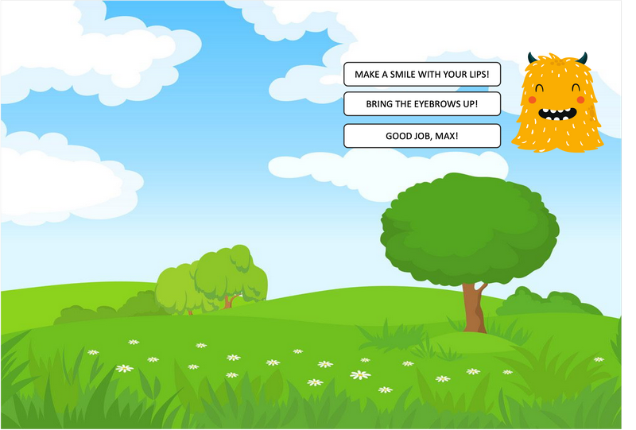

# FaceSpeak V2

Therapeutic face-muscle training game for children with cerebral palsy. Children control game characters using facial expressions tracked by webcam — smiling, opening mouth, raising eyebrows, pursing lips, puffing cheeks, wrinkling nose.

Built with pygame + MediaPipe FaceMesh. Single window, 25fps game loop, no terminal required.



---

## Games

### 🎈 Journey to the Star
A boy with a balloon travels across a landscape to reach a star. Three levels of increasing difficulty.

| Expression | Action |
|---|---|
| Open mouth | Boy walks right |
| Smile wide | Balloon rises, lifts boy over hills |
| Raise eyebrows | Boy jumps over gaps |

- **Level 1** — flat path, mouth open only
- **Level 2** — one hill, mouth + smile required
- **Level 3** — hill + gap, all three muscles needed

### 🫧 Bubble Garden
Blow bubbles with pursed lips, pop them with a smile to water flowers.

| Expression | Action |
|---|---|
| Purse lips (sustained) | Blow a bubble |
| Smile wide | Pop the nearest bubble → waters a flower |

Water all 4 flowers to win. Difficulty adjusts the hold duration (Easy 1.5s / Medium 1.0s / Hard 0.7s).

---

## Face Channels

6 muscle channels tracked continuously (0.0 – 1.0):

| Channel | Muscle | Landmarks |
|---|---|---|
| Smile width | Zygomaticus major | 61 ↔ 291 |
| Mouth open | Depressor labii | 16 ↔ 11 |
| Eyebrow raise | Frontalis | 55, 336 vs 4 |
| Lip purse | Orbicularis oris | 61 ↔ 291 (narrowing) |
| Cheek puff | Buccinator | 234 ↔ 454 |
| Nose wrinkle | Nasalis | 168 vs 6 |

All channels use **EMA smoothing + 2-point calibration + hysteresis** — designed for sustained muscle contractions, not quick spikes.

---

## Signal Pipeline

```
webcam frame
  → MediaPipe FaceMesh (478 landmarks)
  → 6 raw distances (normalised by iris width)
  → EMA(α=0.20) smoothing
  → subtract calib_neutral / divide calib_range
  → clip(0, 1)
  → hysteresis (activate > 0.35, deactivate < 0.20)
  → FaceMetrics
```

---

## Achievements

| Achievement | Trigger |
|---|---|
| First Smile | Complete Level 1 for the first time |
| Big Opener | Mouth open > 80% for 2 seconds |
| Sky High | Balloon max height 3× in one session |
| Bubble Master | Pop 20 bubbles in one session |
| All Muscles | All 6 channels activated in one session |
| 5 Day Streak | Played 5 consecutive days |

---

## Installation

### Requirements
- macOS (tested on M1/M2)
- Python 3.10+ (conda/miniforge recommended)
- Webcam

### Setup

```bash
git clone https://github.com/Lipskerov/FaceSpeak-v2.git
cd FaceSpeak-v2
pip install -r requirements.txt
```

`requirements.txt`:
```
pygame>=2.5.0
mediapipe==0.10.14
opencv-python>=4.8.0
numpy>=1.24.0,<2.0.0
```

> **Note:** `mediapipe==0.10.14` is pinned — later versions dropped the `solutions` API. `numpy<2.0` is required for mediapipe compatibility.

### Run

```bash
python main.py
# or
./run.sh
```

The app auto-selects the built-in FaceTime camera, skipping iPhone Continuity Camera if connected.

---

## Calibration

On first launch, click **Calibrate Face** from the menu. The 3-step wizard guides you through:

1. **Neutral** (3s) — relax your face completely
2. **Max activation** (2s × 6 channels) — prompted one at a time with instructions
3. Calibration saved to `data/progress.json` and reloaded on next launch

Channels with insufficient range (< 0.05 after normalisation) are automatically disabled so they don't cause frustration.

---

## Project Structure

```
FaceSpeak-v2/
├── main.py                   # pygame window, 25fps clock, camera selection
├── setup.py                  # py2app config for FaceSpeak.app
├── requirements.txt
│
├── core/
│   ├── face_tracker.py       # MediaPipe FaceMesh → (478, 3) landmark array
│   ├── metrics.py            # FaceMetrics dataclass (6 float fields)
│   ├── signal_processor.py   # EMA, calibration, hysteresis
│   └── session.py            # Achievements, scores, streaks → progress.json
│
├── games/
│   ├── base_game.py          # Abstract base: update(), draw(), reset()
│   ├── game_journey.py       # Journey to the Star (3 levels)
│   └── game_bubbles.py       # Bubble Garden
│
├── ui/
│   ├── screen_manager.py     # State machine: MENU→CALIBRATE→PLAY→WIN
│   ├── screen_menu.py        # Game picker + achievement badges
│   ├── screen_calibrate.py   # 3-step calibration wizard
│   ├── screen_play.py        # Game + webcam corner + HUD
│   ├── screen_win.py         # Coin shower + achievement unlock
│   ├── hud.py                # 6 animated muscle bars
│   └── webcam_widget.py      # cv2 frame → pygame Surface
│
├── resources/                # Game assets (PNG)
└── data/
    └── progress.json         # Per-profile calibration, scores, achievements
```

---

## Mac App Packaging

```bash
pip install py2app
python setup.py py2app
# → dist/FaceSpeak.app
```

The `.app` can be double-clicked to launch with no terminal. Camera permission dialog appears on first launch (`NSCameraUsageDescription` set in plist).

---

## V1 → V2 Changes

| | V1 | V2 |
|---|---|---|
| UI | wxPython, 4 floating windows | pygame, single window |
| Face tracking | mediapipe 0.9 | mediapipe 0.10.14 |
| Channels | 3 (smile, mouth, eyebrow) | 6 (+ lip purse, cheek puff, nose wrinkle) |
| Signal detection | Derivative spike detector | EMA + hysteresis (continuous 0→1) |
| Calibration | Single-point neutral only | 2-point per channel (neutral + max) |
| Games | Journey (1 level) | Journey (3 levels) + Bubble Garden |
| Packaging | Manual terminal launch | py2app → FaceSpeak.app |

---

## Therapeutic Rationale

Children with cerebral palsy often have reduced facial muscle control. This app provides:

- **Biofeedback** via real-time muscle bars showing activation level
- **Sustained contraction training** — games require holding expressions, not quick twitches
- **Progressive difficulty** — levels introduce muscles one at a time
- **Positive reinforcement** — coins, achievements, and win animations
- **Per-session progress tracking** with streaks to encourage daily practice
